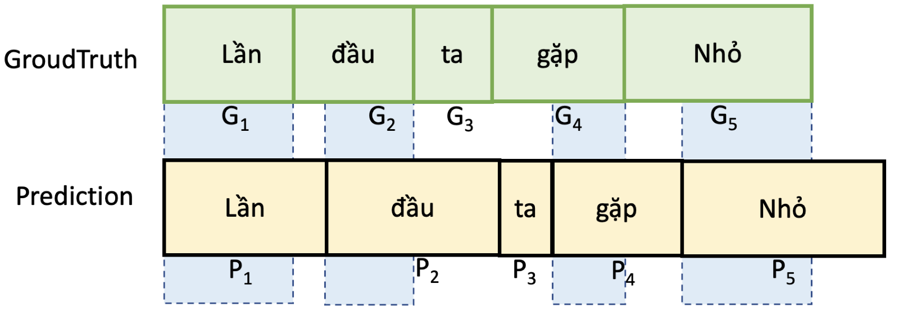
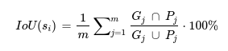

# Lyrics Alignment in ZALO AI 2022 Challenge 3 

#### -- Project Status: [Active]

## Overview
### Problem statement

Many of us love to sing along with songs in the way of our favorite singers in albums (karaoke style). To make it, we may need to remove the vocals of the singer(s) from the songs, then provide the lyrics aligned timely with the accompaniment sounds. There are various tools to remove vocals, but it is hard to align the lyrics with the song.

In this challenge, participants will build a model to align lyrics with a music audio.

* Input: a music segment (including vocal) and its lyrics.

* Output: start-time and end-time of each word in the lyrics.

## Evaluation
### Accuracy
Accuracy of prediction will be evaluated using Intersection over Union (IoU).
With IoU metric, the higher the better. The winner is the one achieving the highest IoU score.



IoU of prediction and the ground truth of an audio segment (𝑠𝑖) is computed by the following formula:



With IoU metric, the higher the better. The winner is the one achieving the highest IoU score.

## Datasets
Dataset is available [here]()
### Training data:
1057 music segments from ~ 480 songs.

Each segment is provided with an audio formatted as WAV file and a ground-truth JSON file which includes lyrics and aligned time frame of each single word as the above example.

### Testing data:
Public test: 264 music segments from ~ 120 songs without aligned lyric files.

Private test: 464 music segments from ~ 200 songs without aligned lyric files.

### Methods Used
1. Use [Spleeter](https://github.com/deezer/spleeter)/[Demucs](https://github.com/facebookresearch/demucs) to extract voice from music
2. Resampling audio to 16k (The default sampling rate)
3. Fine-Tuning the pretrained model [Wav2vec](https://huggingface.co/nguyenvulebinh/wav2vec2-base-vietnamese-250h) with CTC loss
4. Force-alignment between audio and lyrics.
5. Generate time-stamps of each word in lyrics

## Usage
* Using arguments:
    * ```--train``` : Training
    * ```--test``` : Testing
* For Example (Testing):
    Run the Script:
    ```
    python main.py --test
    ```

## Dataset
* The complete Dataset is available [here]()

## Contact
* Feel free to contact me through pvhung1302@gmail.com